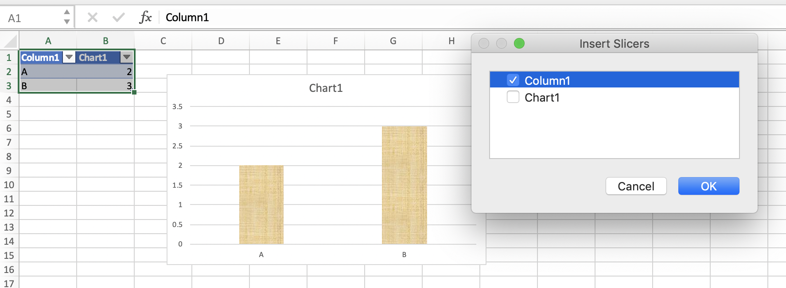

## Overview

### Purpose
- introduce visualization tools in Excel interface
- review what Excel can and can't do
- troubleshooting issues with misbehaving data

### Getting to know the data menu

Visualization tools in Excel are generally under the "Insert" menu because you are inserting a chart or other visual into a spreadsheet.

Once you have data in a spreadsheet, Excel has a chart recommender tool. Decent way to see if your data is formatted in a meaningful way.

When a chart is created two new menus appear, "Chart Design" and "Format" which are specific to the chart.

Additional options are enabled based on the nature of your data or chart.

To turn a section of your data into a pivot table quickly use "CTRL+T" (both mac and pc). Creating a pivot table enables the "Slicer" option in the "Insert" menu.

Once selected Excel asks you to specify what information you want to slice your data by. What you select here will set which filters appear in the slicer. Each datapoint in your selection will be an option.

The slicer produces a quick filter pane that you can reposition as needed.

This feature is particularly handy if you are planning to create many similar visuals off of your data.
