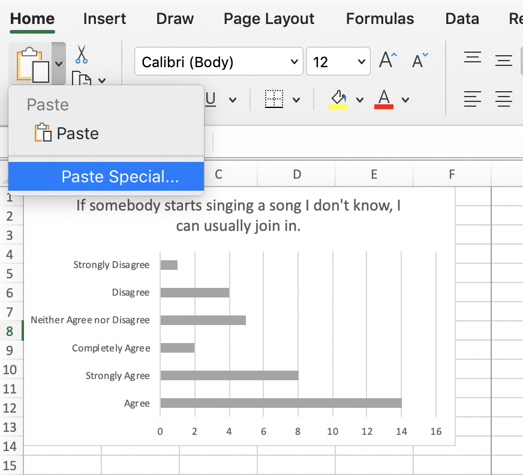
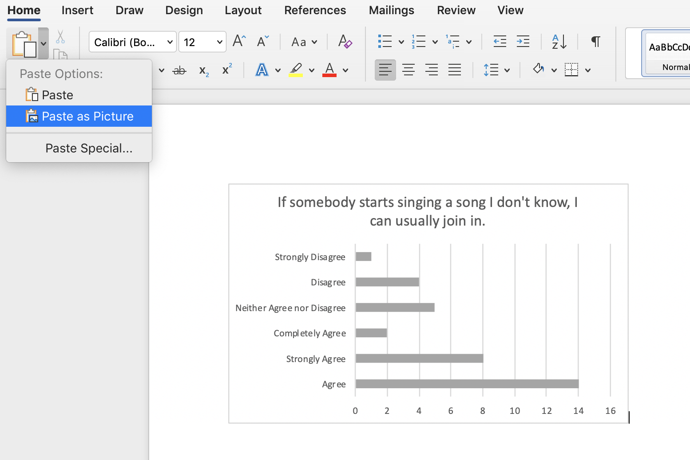
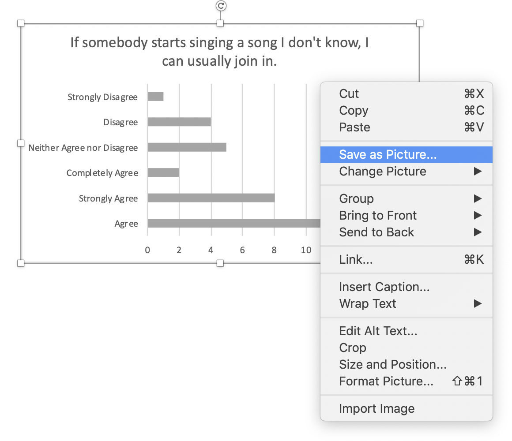

First, to save a chart as an image in Excel use the "Copy as picture" function which is accessible from the drop down menu next to "Copy" in the "Home" tab"

Generally as shown on screen will get you what you need.

From here you have several options.

You can paste the chart as an image into your Excel spreadsheet.

You can paste into a different tool such as as Word or Powerpoint.

